# WAH – Web Audit Helper 🧠

[](https://www.npmjs.com/package/web-audit-helper)
[](https://opensource.org/licenses/MIT)
[](https://www.typescriptlang.org/)

WAH is a **framework-agnostic JavaScript/TypeScript library** that helps developers audit web pages for accessibility, SEO, semantic HTML, responsive design, security, quality, performance, and form validation.

It provides **real-time DOM analysis**, a **floating visual overlay**, **console diagnostics**, and **exportable reports**, with browser usage kept lightweight and CLI/headless support backed by `jsdom`.

---

## ✨ Features

- ♿ **75 Audit rules** across 8 categories (Accessibility, SEO, Semantics, Responsive, Security, Quality, Performance, Forms)
- 🧱 **Semantic HTML analysis** (proper elements, H1 hierarchy, main/nav/section structure)
- 🔍 **SEO best practices** (title, meta description, viewport, canonical, Open Graph, Twitter Cards)
- 📱 **Responsive design heuristics** (viewport meta, fixed-width, 100vh issues, overflow)
- 🔒 **Security checks** (target=_blank, tabnabbing, mixed content, unsafe patterns)
- ⚡ **Performance optimization** (image optimization, lazy loading, async decode, script placement, caching, render-blocking resources)
- 📋 **Form validation** (proper types, autocomplete, required indicators, label association)
- 🎨 **Interactive overlay** with drag, hide, category filters, and issue focus
- 📊 **5 scoring modes** (strict/normal/moderate/soft/custom) with auto-calibration
- 📤 **Export reports** (JSON, TXT, HTML) with complete metadata
- 🧩 **Framework-agnostic** (works with vanilla JS, React, Vue, Angular, etc.)
- 🧹 **CLI/headless runtime included** (`jsdom`-backed automation support)
- ⏳ **Temporary hide system** (hide overlay for X minutes or until next refresh)
- 🧠 **Console diagnostics** with issue focusing and timestamps
- 🌐 **Internationalization** with English and Spanish support

---

## 🚀 Installation

```bash
pnpm add web-audit-helper
```

You can also install the published package with `npm install web-audit-helper`.

Repository development is standardized on pnpm 11.22 and requires Node.js
20.19+, 22.13+, or 24+. From the repository root, run `pnpm install`; CI uses
the committed `pnpm-lock.yaml` in frozen mode.

### Dependency Notes (Quick)

WAH is designed so browser usage stays lightweight, while Node-based tooling is enabled only for specific scenarios.

- Embedded/browser audits: use the core browser runtime.
- CLI headless audits from Node.js: use `jsdom`.
- Real browser automation from CLI: uses Playwright when `--browser` mode is selected.
- Local external-auditing demos in this repository may use `http-server`.

Some package scanners may report transitive modules (for example encoding, proxy-agent, or similar utility packages). In WAH, these are typically tied to CLI/testing paths rather than normal in-page browser integration.

---

## 📖 Quick Start

### Documentation Map

- Quick Start (this file)
- External Auditing: [External Auditing Guide](docs/external-auditing.md)
- SSR/Next usage: [SSR / Next.js Guide](docs/ssr-frameworks.md)
- Advanced config: [Configuration](docs/configuration.md)
- API reference: [API Reference](docs/api.md)
- Exports and metadata: [Exports and Metadata](docs/exports-metadata.md)
- Chromium extension: [Chromium Extension Plan](docs/chromium-extension.md)
- Roadmap: [Product Roadmap](docs/roadmap.md)

### Which Mode Should I Use?

| Mode | Best for |
| --- | --- |
| embedded | local development and direct app integration |
| external | bookmarklet-driven audits on already-open pages |

Common use cases:

- I am building a site/app and want continuous feedback: use embedded mode.
- I want to audit any page from the browser quickly: use external mode.
- I want CI/headless automation: use CLI headless mode from this repository build (`dist/wah-cli.mjs`).

### Choose a Path

- Browser integration: local development inside your app or page
- External auditing: bookmarklet on already-open pages
- CLI headless: static HTML or browser automation from Node.js
- CI / PR outputs: comparison artifacts for GitHub Actions or GitLab CI
- Extensibility: custom registries and plugin-style rules
- SSR / Next.js: client-only loading with dynamic import

---

## 🎨 Gallery & Features

### Interactive Overlay

**Live Overlay**  
The interactive overlay displays in real-time with issue counts by severity.

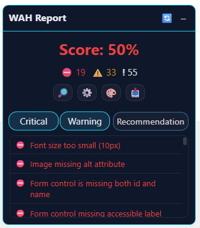

**Customizable UI**  
Modify overlay colors, theming, and appearance to match your workflow.

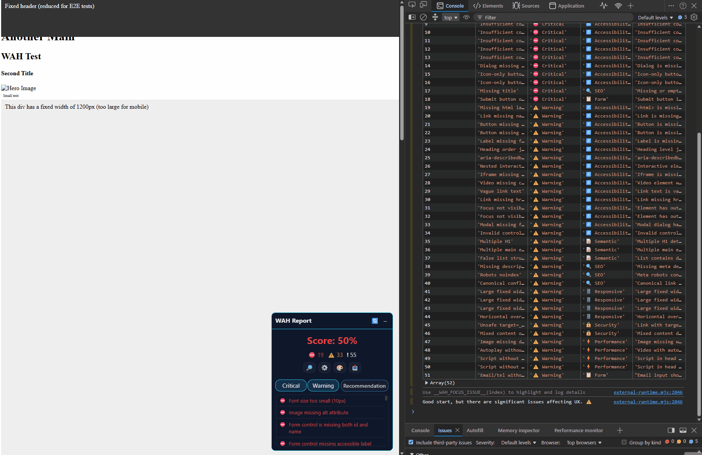

**Issue Navigation**  
Click issues to focus elements in the DOM and scroll to details. Explore findings interactively.

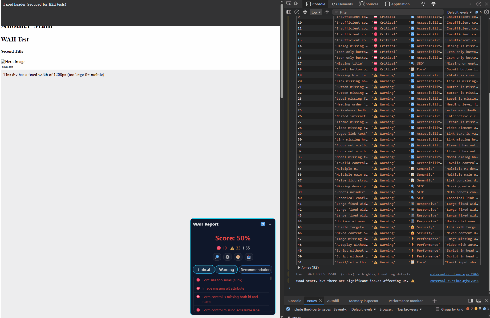

**Filter by Category & Severity**  
Quickly narrow down findings by audit category (Accessibility, SEO, Performance, etc.) or severity level.

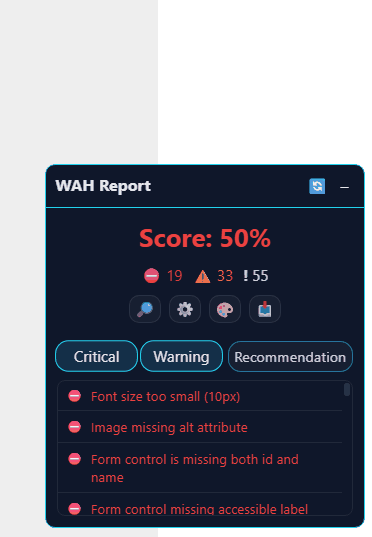

### Settings & Configuration

WAH provides a multi-page settings panel for fine-grained control:

- **Page 1 – Highlight Duration & Console Logs**: Adjust how long elements are highlighted and control log verbosity.

  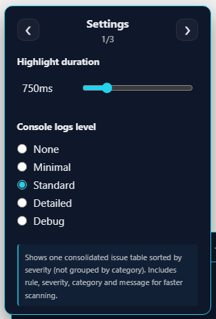

- **Page 2 – Language & Scoring Mode**: Choose between English/Spanish and select scoring modes (strict, normal, moderate, soft, custom).

  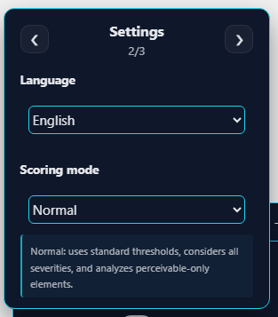

- **Page 3 – Hide & Reset Options**: Temporarily hide the overlay or reset all settings to defaults.

  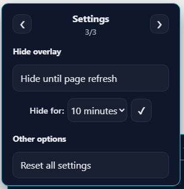

### Console Diagnostics

Detailed console output with grouped issues, timestamps, and actionable insights.

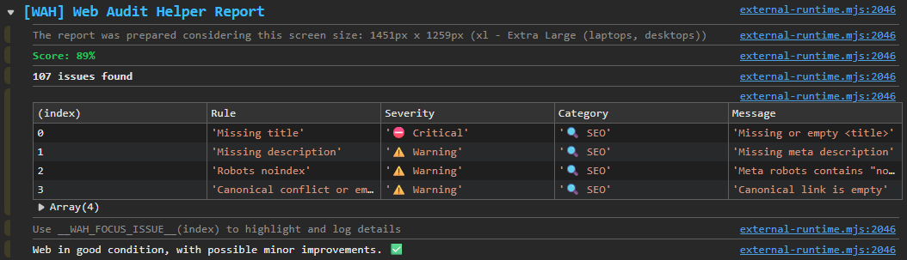

### External Auditing (Bookmarklet)

**Success State**  
The overlay works seamlessly on external pages via bookmarklet injection.

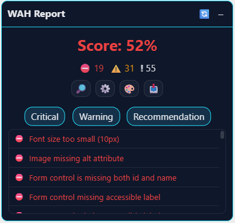

**Comparison Reports**  
Export and compare audit runs side-by-side to track improvements.

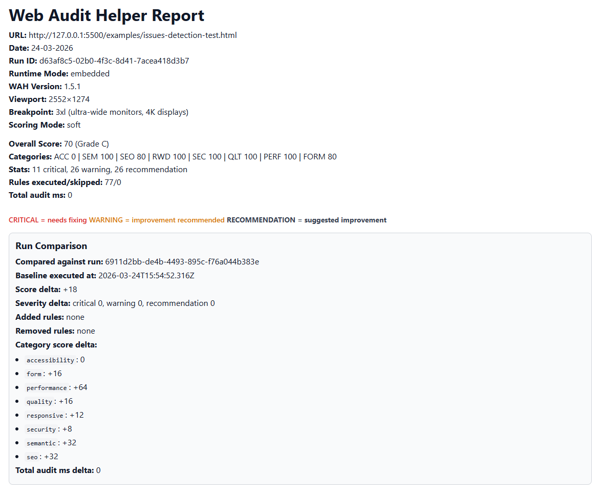

**Metadata & Runtime Info**  
Complete audit metadata including runtime mode, execution time, and WAH version.

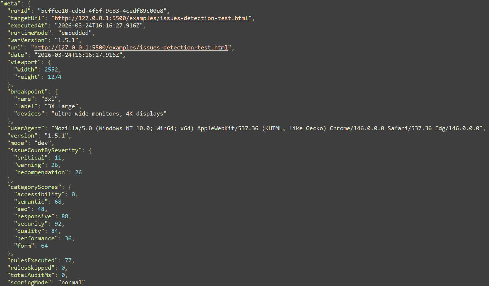

**CSP Error Handling**  
Clear error messaging when Content Security Policy blocks external injection.

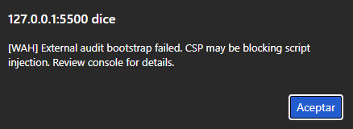

### Reports & Exports

**HTML Report Preview**  
Export beautiful HTML reports with full audit details, scoring breakdowns, and comparison blocks. [View example](docs/assets/html/report-example.html)

### Architecture & Workflow

**System Architecture**  
WAH's architecture follows a modular design:

- **DOM Analysis Layer**: Traverses the page structure and computes CSS properties
- **Rules Engine**: 75+ audit rules organized in 8 categories (Accessibility, SEO, Semantic, Responsive, Security, Quality, Performance, Forms)
- **Scoring Engine**: Calculates overall scores with 5 configurable modes (strict, normal, moderate, soft, custom)
- **Output Modes**: Browser overlay, headless console, or exportable reports (JSON, HTML, TXT)

[See architecture diagram](docs/assets/diagrams/architecture.png)

**Audit Execution Flow**  
The complete audit workflow:

1. Initialize configuration and load rule registry
2. Traverse DOM and collect element analysis data
3. Run all applicable audit rules in parallel or sequence
4. Collect findings and compute severity breakdown
5. Calculate overall score and category scores
6. Output results based on execution context (overlay, console, or file export)
7. Generate shareable reports with optional comparison blocks

[See audit flow diagram](docs/assets/diagrams/audit-flow.png)

### Branding Assets

WAH logo available in multiple formats for documentation, presentations, and integrations:

- **Logo (Horizontal)**: Full logo with "WAH" text and tagline – ideal for headers and promotional materials.  
  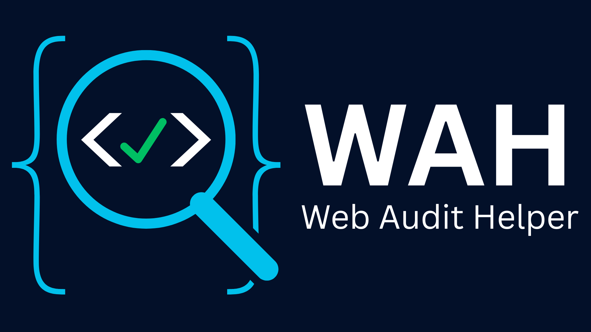

- **Logo (Square)**: Compact square icon for favicons and small spaces.  
  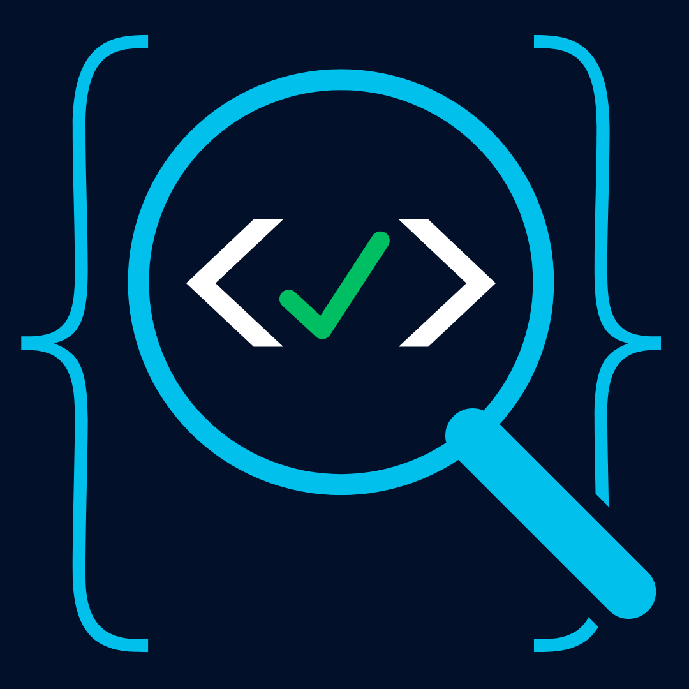

- **Logo (Square with Text)**: Icon plus "WAH" text – perfect for sidebars and compact layouts.  
  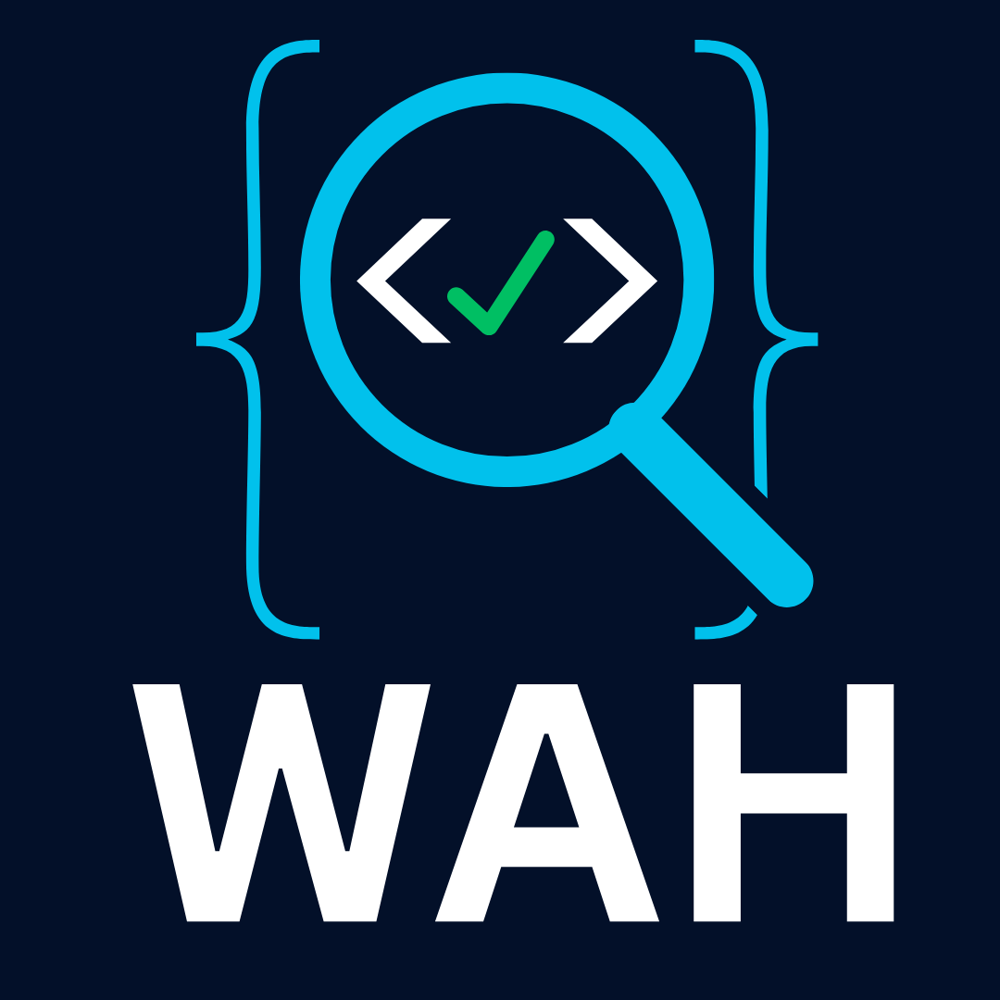

---

### Chromium Extension (Manifest V3)

Build the local-only extension bundle:

```bash
pnpm run build:extension
```

Then open `chrome://extensions`, enable **Developer mode**, choose **Load unpacked**,
and select `dist/extension`. The popup can run, re-run, and remove the audit
overlay on the active page. Settings are shared between audited sites through
`chrome.storage.local`.

Chromium blocks extension injection on protected pages such as `chrome://*` and
the Chrome Web Store. Local `file://` pages require enabling **Allow access to
file URLs** in the extension details.

Create an uploadable ZIP after validation with:

```bash
pnpm run package:extension
```

See [Chromium Extension Guide](docs/chromium-extension.md) for architecture,
testing, limitations, and store-readiness work.

The extension integration suite can be run with:

```bash
pnpm run test:extension:e2e
```

### Browser Integration

CDN:

```html
<script type="module">
  import { runWAH } from 'https://unpkg.com/web-audit-helper@2.1.1/dist/index.mjs';

  await runWAH();
</script>
```

Bundlers:

```javascript
import { runWAH } from 'web-audit-helper';

await runWAH({
  logLevel: 'full',
  issueLevel: 'all',
  accessibility: {
    minFontSize: 12,
    contrastLevel: 'AA'
  },
  overlay: {
    enabled: true,
    position: 'bottom-right'
  }
});
```

For SSR frameworks, load WAH on the client only. See [SSR / Next.js Guide](docs/ssr-frameworks.md).

### External Auditing

WAH includes a generated bookmarklet for already-open pages.

Quick start:

```bash
pnpm run build
```

1. Copy the single line from `dist/bookmarklet.txt`.
2. Create a browser bookmark and paste that line as its URL.
3. Open a target page and click the bookmark.
4. Export JSON or HTML from the overlay when you need evidence or comparison.

Runtime loading strategy:

- Primary: IIFE runtime from jsDelivr (`external-runtime.iife.js`)
- Fallback: ESM runtime from jsDelivr (`external-runtime.mjs`)

External-mode highlights:

- `runtimeMode = external` in exported metadata
- extended run metadata (`runId`, `targetUrl`, `executedAt`, `wahVersion`, `rulesExecuted`, `rulesSkipped`, `totalAuditMs`)
- optional comparison block in JSON and HTML exports when auditing twice

Detailed guide: [External Auditing Guide](docs/external-auditing.md)
Validation, CSP troubleshooting and evidence checklist: [External Auditing QA](docs/external-auditing-qa.md)
Spanish QA guide: [QA de Auditoria Externa](docs/es/external-auditing-qa.md)

### CLI Headless (v2.0)

You can run WAH from Node.js and generate reports directly to files.

Build first:

```bash
pnpm install
pnpm run build
```

Static/local HTML audit (jsdom engine):

```bash
node dist/wah-cli.mjs examples/issues-detection-test.html --format json --output dist/out/static-report.json
node dist/wah-cli.mjs examples/issues-detection-test.html --format html --output dist/out/static-report.html
node dist/wah-cli.mjs examples/issues-detection-test.html --format txt --output dist/out/static-report.txt
```

Playwright browser audit (real URL):

```bash
pnpm exec playwright install chromium
pnpm exec http-server . -p 5510 -c-1
node dist/wah-cli.mjs http://127.0.0.1:5510/examples/issues-detection-test.html --browser chromium --format json --output dist/out/pw-chromium.json
```

Notes:

- Recommended execution directory: repository root.
- From root use `node dist/wah-cli.mjs ...`; from `dist` use `node wah-cli.mjs ...` and `../examples/...` targets.
- Keep the `http-server` terminal open while running browser-mode audits.
- A common infra error is `ERR_CONNECTION_REFUSED` when the local server is not running.
- Test outputs used in validation are written under `dist/out`.

### CI / PR Outputs (v2.0 Phase 4)

When running with `--compare-with`, WAH can emit CI-oriented artifacts in addition to the normal report:

- Compact JSON for machine parsing: `--comparison-ci-json-output`
- Generic Markdown summary for PR/workflows: `--comparison-summary-output`
- GitHub Actions summary: `--github-actions-summary-output`
- GitLab CI summary: `--gitlab-summary-output`

Example:

```bash
node dist/wah-cli.mjs examples/issues-detection-test.html --format json --output dist/out/baseline.json
node dist/wah-cli.mjs examples/issues-detection-test.html --format json --compare-with dist/out/baseline.json --comparison-ci-json-output dist/out/comparison-ci.json --github-actions-summary-output dist/out/gha-summary.md --gitlab-summary-output dist/out/gitlab-summary.md --output dist/out/compare.json
```

GitHub Actions snippet:

```yaml
- name: Build WAH
  run: pnpm run build

- name: Run comparison
  run: |
    node dist/wah-cli.mjs examples/issues-detection-test.html --format json --output dist/out/baseline.json
    node dist/wah-cli.mjs examples/issues-detection-test.html --format json --compare-with dist/out/baseline.json --comparison-ci-json-output dist/out/comparison-ci.json --github-actions-summary-output dist/out/gha-summary.md --output dist/out/compare.json

- name: Publish summary
  shell: bash
  run: cat dist/out/gha-summary.md >> "$GITHUB_STEP_SUMMARY"
```

GitLab CI snippet:

```yaml
wah_audit:
  script:
    - pnpm run build
    - node dist/wah-cli.mjs examples/issues-detection-test.html --format json --output dist/out/baseline.json
    - node dist/wah-cli.mjs examples/issues-detection-test.html --format json --compare-with dist/out/baseline.json --comparison-ci-json-output dist/out/comparison-ci.json --gitlab-summary-output dist/out/gitlab-summary.md --output dist/out/compare.json
  artifacts:
    when: always
    paths:
      - dist/out/compare.json
      - dist/out/comparison-ci.json
      - dist/out/gitlab-summary.md
```

For strict automation, prefer the compact JSON output. Use Markdown outputs for human-facing summaries.

### Extensibility API (Phase 5)

WAH now exposes a base registry API so custom rules can be composed without mutating the built-in registry.

```ts
import {
  buildAuditReport,
  createCoreRuleRegistry,
  createRulePlugin,
  createRuleRegistry,
  extendRuleRegistry,
  runWAHHeadless
} from 'web-audit-helper';

document.body.innerHTML = `
  <main>
    <section data-legacy-widget="true">Legacy widget</section>
  </main>
`;

const legacyWidgetPlugin = createRulePlugin({
  name: 'legacy-widget-plugin',
  rules: createRuleRegistry([
    {
      id: 'QLT-PLUGIN-01',
      category: 'quality',
      defaultSeverity: 'warning',
      title: 'Detect legacy widget markers',
      fix: 'Remove legacy widget markup or migrate it to the supported component.',
      docsSlug: 'plugin-legacy-widget-marker',
      standardType: 'heuristic',
      standardLabel: 'Project plugin rule',
      run: () => {
        return Array.from(document.querySelectorAll('[data-legacy-widget]')).map((element) => ({
          rule: 'QLT-PLUGIN-01',
          message: 'legacy widget marker found',
          severity: 'warning',
          category: 'quality',
          element: element as HTMLElement,
          selector: '[data-legacy-widget]'
        }));
      }
    }
  ])
});

const registry = extendRuleRegistry(createCoreRuleRegistry(), {
  plugins: [legacyWidgetPlugin]
});

const result = await runWAHHeadless({}, { registry });
const report = result ? buildAuditReport(result, undefined, registry) : undefined;

console.log(report?.categories.find((category) => category.id === 'quality')?.rules);
```

Use the same `registry` for both execution and `buildAuditReport(...)`; otherwise custom metadata such as title, fix and docs slug will not be available in the serialized report.

SSR frameworks such as Next.js, Nuxt or SvelteKit must load WAH on the client only. Complete patterns and examples: [SSR / Next.js Guide](docs/ssr-frameworks.md)

---

## ⚙️ Configuration

The most commonly tuned areas are:

- `consoleOutput`, `logLevel` and `logging` for console verbosity
- `issueLevel` and `scoringMode` for audit scope and scoring behavior
- `rules` for stable rule-level overrides (`off`, severity overrides and supported thresholds)
- `auditMetrics` for per-rule timings and report inclusion
- `locale` and `overlay` for UI behavior

### Configuration Examples

```javascript
// Developer-friendly console output
await runWAH({
  scoreDebug: true,
  logging: {
    timestamps: true,
    groupByCategory: true,
    showStatsSummary: true,
    useIcons: true
  }
});

// Minimal clean output
await runWAH({
  logging: {
    timestamps: false,
    groupByCategory: false,
    showStatsSummary: false,
    useIcons: false
  }
});

// Custom rule configuration with metrics
await runWAH({
  rules: {
    'ACC-22': { threshold: 16 },  // Custom font size minimum
    'ACC-01': 'off',              // Disable html lang check
    'SEO-01': { severity: 'critical' }  // Upgrade to critical
  },
  auditMetrics: {
    enabled: true,
    consoleTopSlowRules: 5,
    consoleMinRuleMs: 1
  }
});
```

Full option reference, supported thresholds and presets: [Configuration Guide](docs/configuration.md)
Spanish version: [Guia de Configuracion](docs/es/configuration.md)
Contribution guide: [Contributing](docs/contributing.md)
Guia de contribucion: [Contribuir](docs/es/contributing.md)
Publicación de versiones: [GitHub y npm](docs/es/releasing.md)

---

## 📊 Scoring System

WAH calculates an overall score from **0-100** with grades **A-F**.

Available scoring modes:

- `strict`: most aggressive penalties
- `normal`: balanced default
- `moderate`: ignores recommendations
- `soft`: only critical issues
- `custom`: filtered severities/categories with auto-calibrated multipliers

Scoring details and filters are documented in [Configuration Guide](docs/configuration.md).

---

## 🎯 Audit Rules (75 Total)

WAH covers 8 categories:

- Accessibility
- Semantic HTML
- SEO
- Responsive Design
- Security
- Quality
- Performance
- Forms

**For complete rules reference**, see [Rules Documentation](docs/rules.md).
Quick index by rule ID: [Rules Guide](docs/rules-guide.md).
Spanish version: [Documentacion de Reglas](docs/es/rules.md).
Indice rapido en espanol: [Guia de Reglas](docs/es/rules-guide.md).

---

## 🎮 Console Commands

WAH exposes global commands for interaction:

### `__WAH_FOCUS_ISSUE__(index)`

Highlights a specific issue element in the DOM and logs its details.

```javascript
__WAH_FOCUS_ISSUE__(0)  // Focus on first issue
```

### `__WAH_RESET_HIDE__()`

Clears hide settings and reloads the overlay.

```javascript
__WAH_RESET_HIDE__()  // Restore overlay immediately
```

### `__WAH_RERUN__()`

Re-runs the audit after DOM changes without page reload.

```javascript
__WAH_RERUN__()  // Refresh audit
```

## ⌨️ Keyboard Shortcuts

WAH overlay supports keyboard shortcuts for improved accessibility and productivity:

- **Escape**: Toggle overlay collapse/expand
- **Ctrl/Cmd + E**: Rerun audit
- **Alt + W**: Focus on overlay (for keyboard navigation)
- **Tab/Shift+Tab**: Navigate through overlay controls with focus trap

All interactive elements support keyboard navigation with visible focus indicators.

---

## 📤 Export Reports

Run WAH with logging enabled to export reports to the console:

```javascript
await runWAH({
    logs: true,
    logLevel: 'full'
});

// Reports are printed to console as:
// - Table format (filtered by category and severity)
// - JSON export
// - TXT export (with detailed formatting)
// - HTML export (full report with styling)
```

Reports include:

- Overall score and grade
- Score by category
- Detailed issue list with CSS selectors
- Applied filters and scoring mode
- Viewport and user agent info
- Timestamp and WAH version

---

## 🎨 Overlay & Interface

The overlay provides a floating interface with:

- **Score badge**: Displays overall score and grade
- **Category breakdown**: Shows individual category scores
- **Issue list**: Filterable by severity (critical/warning/recommendation) and category
- **Issue focus**: Click to highlight elements in the DOM
- **Filters**: Toggle severities and categories to customize scoring
- **Settings**: Configure scoring mode, hide behavior, and language selector (`en`/`es`) with persistence across reloads
- **Export**: Download audit reports in JSON, TXT, or HTML format
- **Hide**: Temporarily hide overlay for X minutes or until next refresh

Architecture details and internals: [Architecture Guide](docs/architecture.md)

---

## 🏗️ Architecture

WAH is organized into four main modules:

- **`core/`**: audit engine and rules
- **`overlay/`**: visual UI and interactions
- **`reporters/`**: JSON, TXT and HTML outputs
- **`utils/`**: shared helpers and console behavior

**For architecture details**, see [Architecture Guide](docs/architecture.md).
Spanish version: [Guia de Arquitectura](docs/es/architecture.md).

---

## 🔧 API Reference

Main entry points:

- `runWAH(userConfig)` for in-browser interactive audits
- `runWAHHeadless(userConfig, executionOptions)` for overlay-free execution
- `runCoreAudit(config, executionOptions)` for lower-level engine usage
- `buildAuditReport(result, config, registry)` for JSON/TXT/HTML-ready report objects

Complete signatures and usage details: [API Reference](docs/api.md)
Spanish version: [Referencia de API](docs/es/api.md)

---

## 🌐 Internationalization

Built-in locales are `en` and `es`. Internal IDs and config keys stay in English, while user-facing strings are localized across overlay, console and human-readable reports.

For contribution workflow and community translation model, see [Translations Guide](docs/translations.md).

---

## ❓ FAQ / Troubleshooting

### `Module not found: Can't resolve 'web-audit-helper'`

Package not installed, workspace misconfigured, or lockfile inconsistency.

Run `pnpm install` from the repository root and keep `pnpm-lock.yaml` in sync. If
the package is missing from a consuming project, install it explicitly with
`pnpm add --save-dev web-audit-helper`.

### `ReferenceError: window is not defined`

WAH is browser-only. In SSR frameworks, load it in a client component via dynamic import. See [SSR / Next.js Guide](docs/ssr-frameworks.md).

### WAH runs twice in development (React Strict Mode)

Use a `useRef` guard in development. The complete pattern is shown in [SSR / Next.js Guide](docs/ssr-frameworks.md).

### Issues detected vary between page refresh (F5) and re-run button

DOM state may differ between a fresh page load and a later re-audit. Use `__WAH_RERUN__()` after significant DOM changes, or refresh the page for a clean baseline.

---

## 🧪 Testing

```bash
pnpm run test        # Run tests once
pnpm run test:watch  # Watch mode
pnpm run test:ui     # Interactive UI
pnpm run test:coverage # Coverage gate
pnpm run test:e2e    # Chromium E2E (build first)
pnpm run test:extension:e2e # Unpacked Chromium extension E2E
pnpm run test:all    # Typecheck, unit tests, build and E2E
```

---

## 🤝 Contributing

We welcome contributions! Please read [Contributing Guide](docs/contributing.md) and [Guia de Contribucion](docs/es/contributing.md) for guidelines on:

- Reporting issues
- Submitting pull requests
- Adding new rules
- Code style and conventions

---

## 📋 Roadmap

Current and future roadmap is maintained in:

- [Product Roadmap](docs/roadmap.md)

Release-by-release historical details are maintained in:

- [CHANGELOG](CHANGELOG.md)
- [Release Notes](RELEASE-NOTES.md)

---

## 📄 License

MIT – See [LICENSE](LICENSE) for details

---
