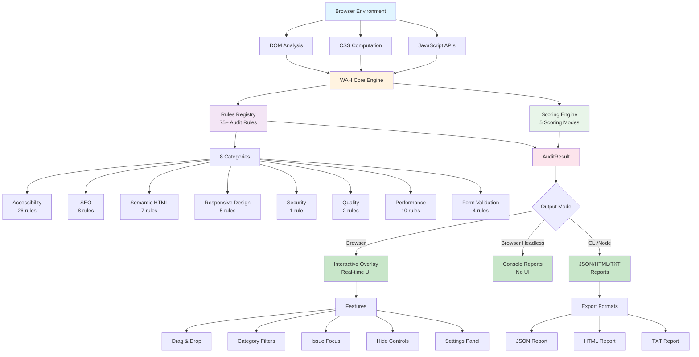

# Architecture Diagram

This diagram should be generated as `architecture.png` and used in documentation.

**Mermaid code** (can be converted to PNG using tools like mermaid.live or mermaid-cli):



**How to convert to PNG:**

1. Visit [mermaid.live](https://mermaid.live)
2. Paste the Mermaid code above
3. Right-click diagram → Download as PNG
4. Save as `docs/assets/diagrams/architecture.png`

**Alternative (CLI):**

```bash
pnpm add --global @mermaid-js/mermaid-cli
mmdc -i architecture.mmd -o architecture.png
```
