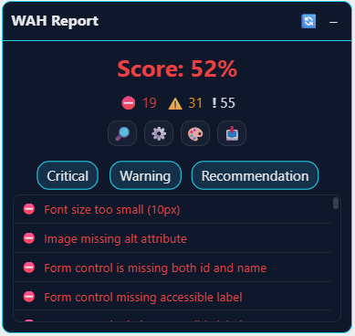
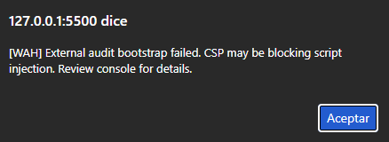
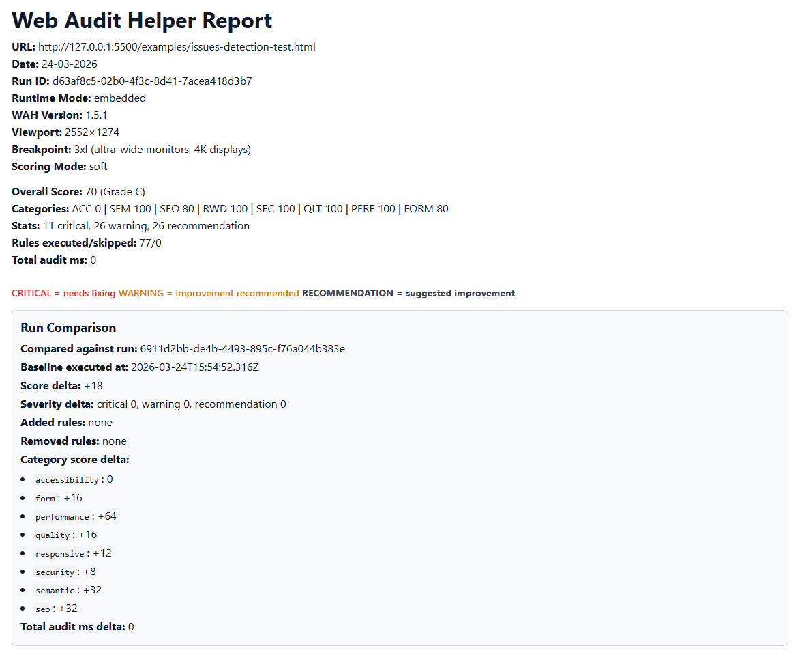
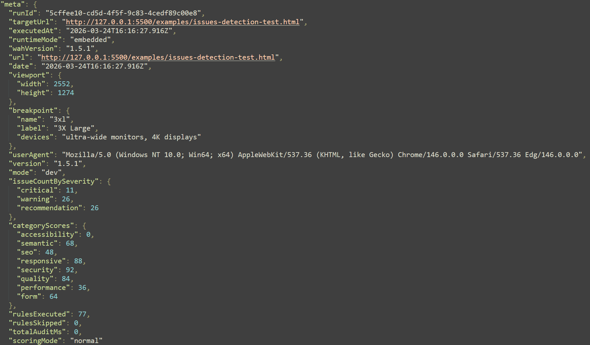

# External Auditing Guide

This guide explains the user-oriented external auditing flow introduced in v1.5.0.

## What It Is

External auditing lets you run WAH on an already-open page without integrating WAH into that project codebase.

Use cases:

- quick one-off audits on public pages
- exploratory QA on third-party sites
- baseline snapshots before and after UI changes

## How It Works

1. Trigger bookmarklet from browser.
2. Load external runtime bundle (IIFE primary, ESM fallback).
3. Run audit in `runtimeMode = external`.
4. Render overlay and allow report exports.

If runtime injection is blocked (typically by strict CSP), WAH shows a clear error and aborts.

Current external bootstrap error codes:

- `WAH:E-EXT-CSP-OR-NETWORK`: both runtime paths failed (common CSP/network issue)
- `WAH:E-EXT-IIFE-API`: IIFE loaded but global API is unavailable
- `WAH:E-EXT-ESM-API`: ESM loaded but `runExternalWAH` export is unavailable
- `WAH:E-EXT-BOOTSTRAP`: generic fallback code for unknown bootstrap failures

## Installation Flow

1. Build repository artifacts:

```bash
npm run build
```

1. Copy `dist/bookmarklet.txt` into a browser bookmark URL.
1. Open target page and click bookmark.

## Missing bookmarklet.txt

If you test from another repository (for example a React/PHP project) that does not run this repository build pipeline, `dist/bookmarklet.txt` may not exist there.

Use either:

- bookmarklet generated from this repository build
- bookmarklet from published package version

## Real-Page Validation

Recommended minimum:

- one static page target
- one SPA target

For each target:

- capture overlay success/failure
- export JSON and verify `meta.runtimeMode = external`
- run a second audit and verify comparison output in JSON/HTML

## Evidence Examples









## Related Docs

- QA checklist EN: [External Auditing QA](external-auditing-qa.md)
- QA checklist ES: [QA de Auditoria Externa](es/external-auditing-qa.md)
- Export contract details: [Exports and Metadata](exports-metadata.md)
